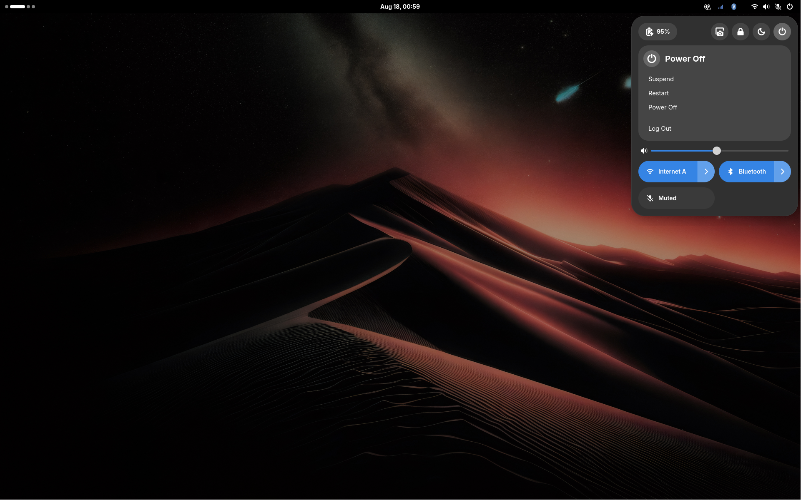
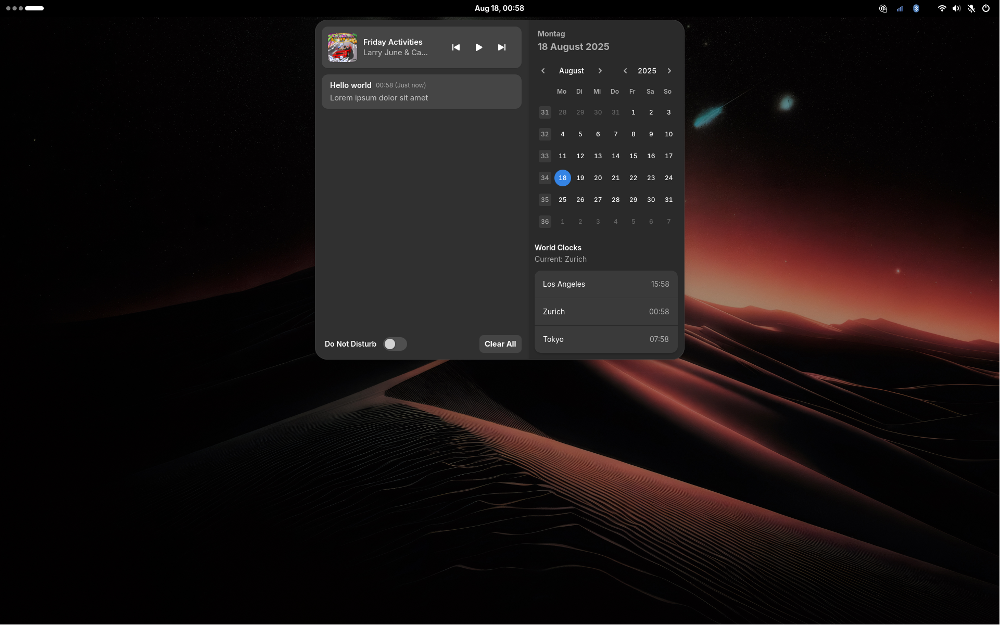
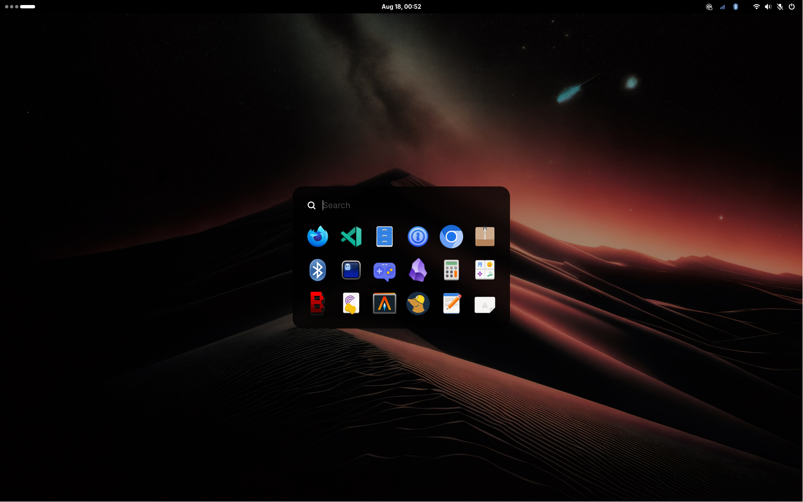
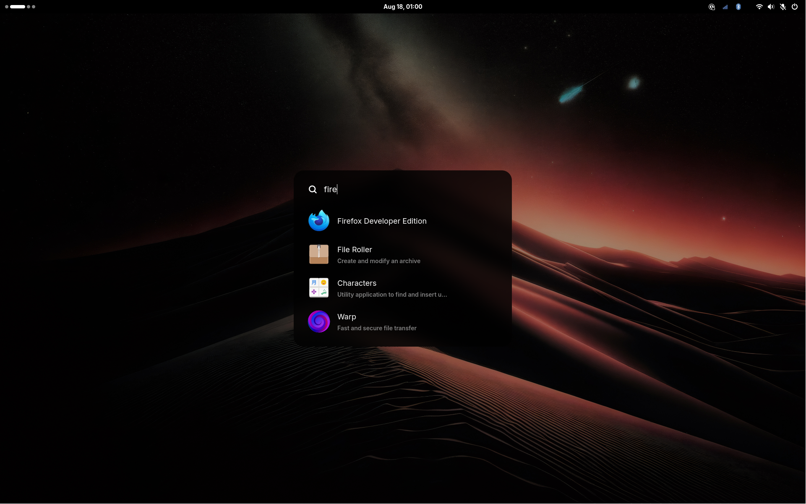

# adw-shell

This is a shell configuration based on [AGS v3](https://aylur.github.io/ags), designed to mimic the default libadwaita style. It includes a status bar, notification center, launcher, and other widgets, and is built using TypeScript with JSX components. The aim is to replicate the look and feel of GNOME Shell on other compositors such as Hyprland. Advanced GNOME features such as extensions are out of scope, of course.

## Screenshots

